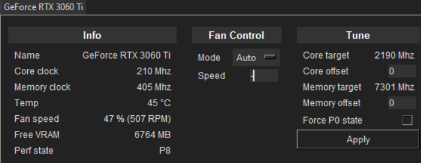

## What is this  
Python bindings for Nvidia API. Not ready for production, currently just tinkering and trying to make everything work.  
  
## Examples  
`run.py` starts GUI (screenshot above), written in Tkinter.  
`overclock.py` used for testing, tries to overclock GPU0 core by 50Hz and checks the result  